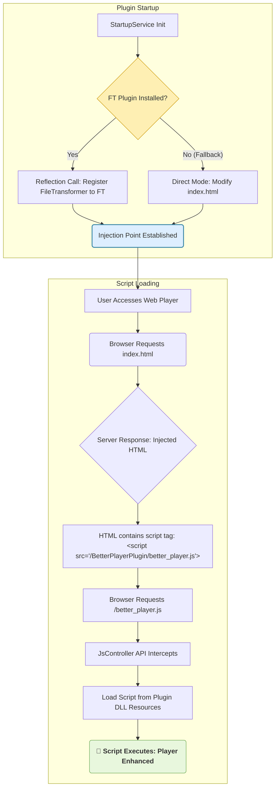

# Better Web Player Extension (Better Player)

## 🎥 项目概述：Web 播放增强脚本注入框架

**Better Web Player Extension** 的核心价值在于提供一个**灵活、通用的 JavaScript 脚本注入框架**，专门为 Jellyfin Web 客户端设计。
目前通过内置 `better_player.js`，提供类似 **B 站** 的沉浸式播放体验。

### 核心目的与价值

* **当前版本 (v1.x): 稳定功能部署。** 插件默认内置并注入了桂鸢原作者开发的优秀前端脚本 `better_player.js`，为用户提供即时的播放器增强体验，无需手动配置脚本管理器。
* **未来目标 (v2.x+): 高度自定义。** 本插件将允许用户通过设置界面，指定任何外部 JavaScript 脚本的 URL，并将其安全、稳定地注入到 Jellyfin Web 播放页面中，以实现高度个性化的播放器增强。

本插件通过 C# 后端逻辑，利用 **File Transformation Plugin (FT 插件)** 机制，实现脚本的安全、稳定注入。

### 🤖 开发者说明

本项目由 **GolLight** 独立开发和维护，并全程利用 **Google Gemini AI**进行代码生成、架构设计和调试辅助。

---

## 🧩 支持的客户端

| 客户端 | 支持情况 | 备注 |
| :--- | :--- | :--- |
| **Jellyfin Web** | ✅ 完整功能支持 | 在所有主流浏览器中通过 Web UI 访问。 |
| **Jellyfin Android** | ✅ 使用网页播放器时支持 | 通常指通过浏览器或内置 WebView 访问。 |
| **Jellyfin iOS** | ⚠️ 受浏览器限制，部分功能可能不完全可用 | 仅限通过浏览器或内置 WebView 访问。 |

---

## 🌟 核心功能概览

所有以下功能均由默认注入的 `better_player.js` 脚本提供，旨在提供**沉浸式**、**类似 B 站**的交互体验，包括增强的键盘和触控交互、以及鼠标悬停时的 **Trickplay 预览缩略图**等。

### 🎮 桌面端控制 (键盘 / 鼠标)

| 操作 | 效果描述 | 备注 |
| :--- | :--- | :--- |
| **右方向键短按** | 快进 **10 秒** | 精准控制。 |
| **右方向键长按** | 按住时 **2× 倍速播放** | 松开后自动恢复正常速度。 |
| **倍速提示** | 自动显示 | 倍速激活时，屏幕上方显示速度指示器与**呼吸灯动画**。 |

### 📱 移动端控制 (触控)

| 操作 | 效果描述 | 备注 |
| :--- | :--- | :--- |
| **双击视频区域** | 播放 / 暂停 | 快速控制播放状态。 |
| **长按视频区域** | 按住时 **2× 倍速播放** | 松开后自动恢复。 |
| **水平滑动** | 调节播放进度 | 每 **100 像素** ≈ **10 秒**。 |
| **滑动预览** | 自动显示 | 滑动时显示时间预览、自定义进度条，若有预览图则在左下角显示缩略图。 |

---

## 🚀 安装步骤

### ⚠️ 先决条件

1. Jellyfin 服务器版本：**10.11.0 或更高**。
2. 必须安装 **File Transformation Plugin (FT 插件)**，本插件依赖其注入功能。
    > **FT 插件链接:** [https://github.com/IAmParadox27/jellyfin-plugin-file-transformation](https://github.com/IAmParadox27/jellyfin-plugin-file-transformation)

### 1. 添加自定义存储库

在您的 Jellyfin 管理面板中，导航到 **插件** -> **存储库**，并添加以下 URL：

> **存储库 URL (GitHub Raw Link)：**
>
> **`https://raw.githubusercontent.com/GolLight/BetterPlayerPlugin/master/manifest.json`**

### 2. 完成安装

1. 导航到 **目录 (Catalog)** 选项卡。
2. 找到并安装 **"Better Player"** 。
3. 安装后，**重启 Jellyfin 服务器** 以使插件生效。

---

## 💻 开发者技术详情

### ⚙️ 核心原理流程图

该图展示了插件在 Jellyfin 启动时如何注册注入点，以及浏览器如何加载脚本的机制：


### 📁 项目结构概览打包命令（仅构建 DLL，在项目根目录下执行）
```Bash
dotnet build BetterPlayerPlugin/BetterPlayerPlugin.csproj --configuration Release
```

### 目录结构
```Plaintext
BetterPlayerPlugin/
├── .github/
│   └── workflows/
│       └── release.yml        # (代实现) GitHub Actions 自动化发布脚本
├── BetterPlayerPlugin/          # 插件核心代码目录
│   ├── Controllers/             # API 路由控制器
│   ├── Helpers/                 # HTML 注入逻辑核心
│   ├── Providers/               # 依赖注入服务注册
│   ├── Resources/               # 嵌入式资源文件（如 better_player.js）
│   ├── Services/                # 启动和核心服务逻辑
│   ├── BetterPlayerPlugin.csproj #插件工程配置 
│   └── BetterPlayerPluginPlugin.cs  # 插件主文件
├── Images/
│   └── logo.png                 # gemini生成的logo
├── manifest.json                # 插件存储库清单
└── README.md                    # 项目说明文件
```
# 🔧 关键文件与目录功能说明

| 文件 / 目录 | 功能 | 简要说明 |
|--------------|------|----------|
| **BetterPlayerPluginPlugin.cs** | 插件主入口 | 定义插件名称、ID (GUID)、版本等基本信息。 |
| **Services/StartupService.cs** | 启动逻辑 | 在 Jellyfin 启动时执行，负责检查 FT 插件状态并注册 HTML 注入机制。 |
| **Resources/better_player.js** | 前端脚本 | 插件核心功能的载体，作为嵌入资源在运行时注入到 Web 播放器中。 |
| **Controllers/BetterPlayerJsController.cs** | API 路由 | 响应浏览器对 `/better_player.js` 的请求，提供脚本内容。 |
| **Helpers/WebHtmlInjector.cs** | 注入核心 | 包含用于修改或拦截 `index.html` 的逻辑实现。 |
| **manifest.json** | 存储库清单 | Jellyfin 插件目录使用的 JSON 文件，包含发布版本的下载链接与校验信息。 |

---

# 🙏 核心功能来源与致谢

### 核心脚本致谢

本插件封装的核心前端增强逻辑（`better_player.js`）全部来源于以下优秀项目。  
本插件**不包含任何前端功能逻辑**，所有播放器增强特性均由原脚本提供。

| 属性 | 内容 |
|------|------|
| **原作者** | 桂鸢 ([guiyuanyuanbao](https://github.com/guiyuanyuanbao)) |
| **原项目仓库** | [betterJellyfinWebPlayer-extension](https://github.com/guiyuanyuanbao/Jellyfin-betterJellyfinWebPlayer-extension) |
| **核心脚本文件** | [better_player.js](https://github.com/guiyuanyuanbao/Jellyfin-betterJellyfinWebPlayer-extension/blob/main/batter_player.js) |

在此衷心感谢原作者 **桂鸢** 提供的优秀前端脚本。👏

---

# 🧩 插件模板与架构参考致谢

本插件的项目结构、C# 架构与 File Transformation (FT) 注入机制  
大量参考了以下项目，在此表示诚挚感谢：

| 项目名称 | 仓库地址 | 作者 |
|-----------|-----------|------|
| **InPlayerEpisodePreview** | [https://github.com/Namo2/InPlayerEpisodePreview](https://github.com/Namo2/InPlayerEpisodePreview) | Namo2 |

---

# 🔗 相关链接

- [Jellyfin 官网](https://jellyfin.org)

💡 **提示**：如果觉得这个项目对您有帮助，请给个 ⭐️ Star 支持一下！
